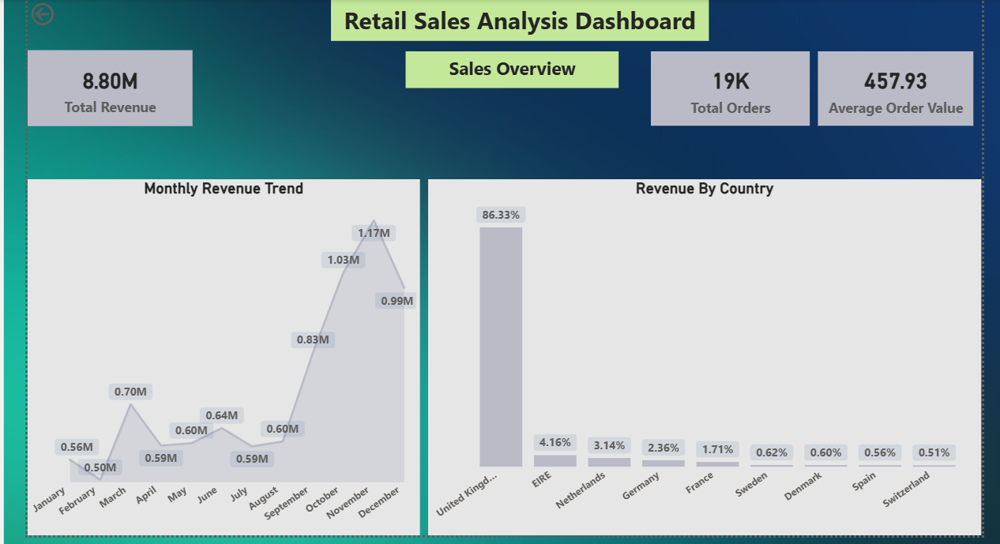
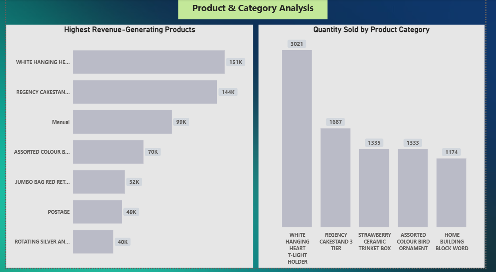
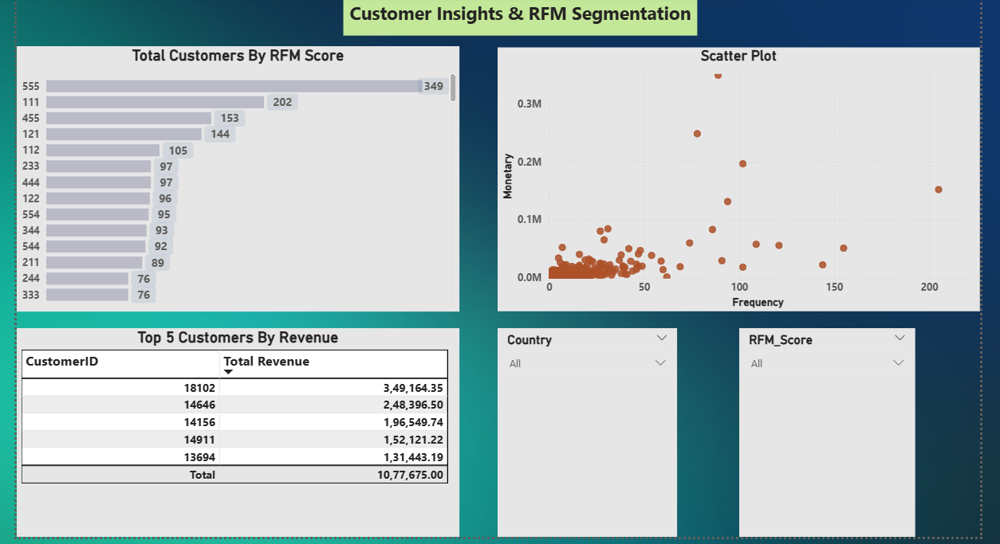
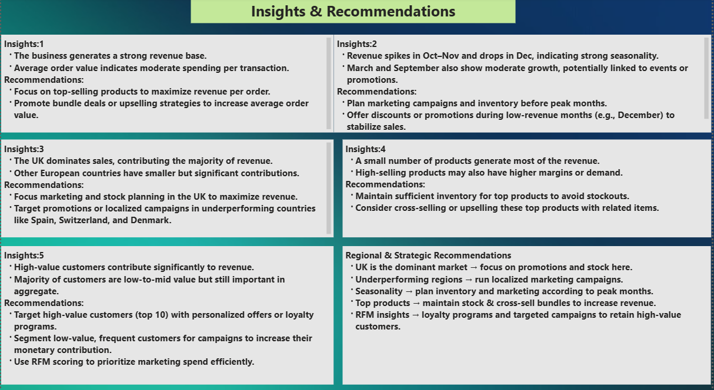

# Retail Sales & Customer Analysis (Python → SQL → Power BI)

## Objective
Analyze retail sales data to understand customer behavior, identify revenue trends, and generate business insights to improve revenue and customer retention.

---

## Tools Used
- **Python (Pandas, NumPy, Matplotlib)** – Data cleaning and exploratory data analysis  
- **SQL (MySQL)** – Data storage and analytical queries  
- **Power BI** – Interactive dashboard and visualization  

---

## Workflow
1. Cleaned and prepared raw dataset using Python.
2. Loaded processed data into SQL database.
3. Performed sales analysis and customer queries using SQL.
4. Conducted **RFM Customer Segmentation** to identify high-value customers.
5. Built an **interactive Power BI dashboard** to visualize insights.
6. Generated **business recommendations based on data insights**.

---

## Key Metrics
- **Total Revenue:** ₹8.8M  
- **Total Orders:** 19,000  
- **Average Order Value (AOV):** ₹457.9  
- **Customer Segmentation:** Based on RFM Analysis  

---

## Power BI Dashboard

### Sales Overview

### Product & Category Analysis

### Customer RFM Segmentation

### Insights & Recommendations

---

## Key Insights

- Total revenue generated: **₹8.8M from 19K orders**
- Average Order Value (AOV): **₹457.9**
- Revenue shows **seasonal growth patterns**
- **Top 10–20% customers contribute a large share of revenue**
- Certain product categories have **high sales volume but lower profitability**

---

## Business Recommendations

- Target **high-value customers** with personalized marketing campaigns
- Promote **top-performing product categories**
- Prepare inventory before **seasonal demand spikes**
- Introduce **loyalty programs** to increase repeat purchases

---

## Project Structure

Retail-Sales-Customer-Analysis  
│  
├── Python/  
│   └── Data cleaning, EDA, and RFM analysis using Jupyter Notebook  

├── SQL/  
│   └── SQL queries for sales and customer analysis  

├── PowerBI/  
│   └── Interactive dashboard (.pbix file)  

├── Dashboard_Screenshots/  
│   └── Sales Overview  
│   └── Product & Category Analysis  
│   └── Customer Insights & RFM Segments  
│   └── Insights & Recommendations  

└── Dataset_Link.txt  
    └── Kaggle dataset source